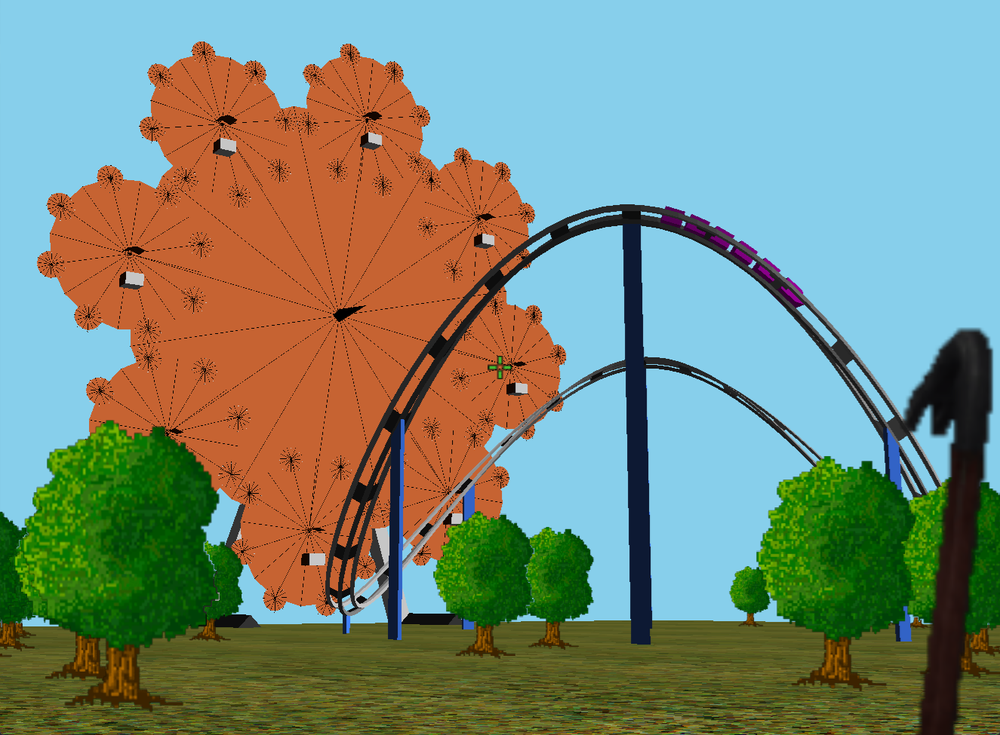

 CS447: Virtual Amusement Park
 
 Computer Graphics Final Project

───────────────────────────────────────────────

 Controls

═══════════════════════════════════════════════

 **Isometric View:       Numline 0**
                                               

 Rotate view around:   Left Mouse (Hold)       

 Zoom camera in/out:   Middle Mouse (Hold)     

 Move camera position: Right Mouse (Hold)      

───────────────────────────────────────────────
 
 **First-Person View:    Numline 1**

                                               
 
 Move camera location: W A S D (Hold)          

 Swing crowbar:        Left Mouse              

 Sprint:               Left Shift (Hold)       

 Crouch:               Left Ctrl (Hold)        

───────────────────────────────────────────────
 
 **Roller Coaster View:  Numline 2**

                                               
 
 Swing crowbar:        Left Mouse              

───────────────────────────────────────────────
 
 **Ferris Wheel View:    Numline 3**

                                               
 
 Swing crowbar:        Left Mouse              

───────────────────────────────────────────────
 
 __*Miscellaneous (Work in all perspectives)*__

                                               
 
 Increase/Decrease Fractal:    Arrow Up/Down   

 Refine ferris Wheel:          Arrow Left/Right

 Change tree density:          NumLine +/-     

 Change perspective:           NumLine 0-4     

 Toggle Crowbar:               E               

═══════════════════════════════════════════════

